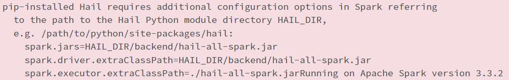

# About
This repository provides instructions to install Hail. These instructions were adapted from those
on the Hail site though needed some modifications for Ubuntu 20.

# Known Issues

## Hail Environment Warning (Ignore)

* After this is setup, with the Hail dependencies added via Databricks library config, we still get a warning: 

# Instructions

## Step 1 - Build Hail

This step will use a generic DBR 11.3 LTS cluster (single node) to build
the core hail artifacts needed for our Hail cluster. This step can take quite a while
which is why we do it once so we don't have to do it again.

1. Create a Single Node DBR 11.3 LTS cluster. It can be a low spec (e.g. 14GB 4 cores)
2. Run the notebook found in "./notebooks/Build Hail"

Once this is done, you will have the hail artifacts installed to DBFS in the path "dbfs:/hail". The two

## Step 2 - Setup Hail Cluster

## Step 3 - Invoke Hail