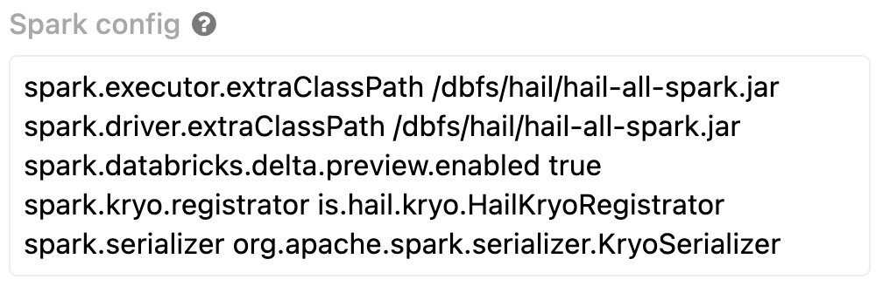
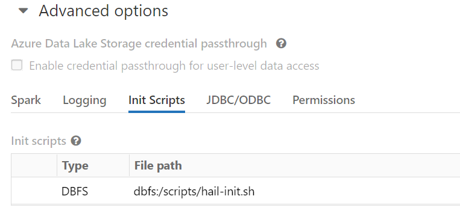
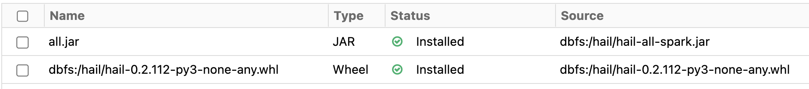
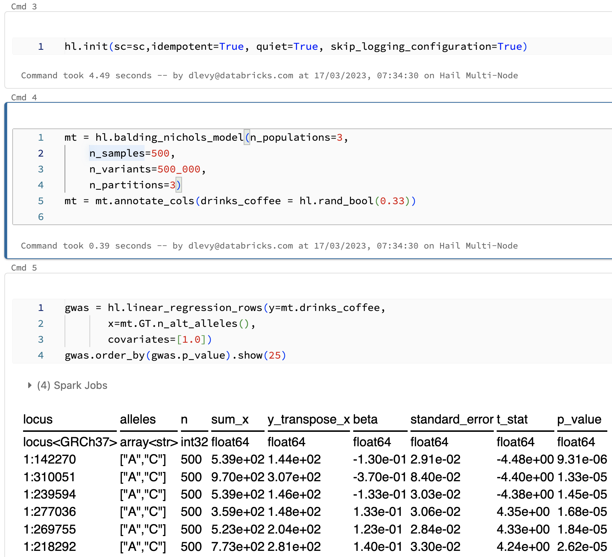

## About
This repository provides instructions to install Hail on a Databricks Cluster. These instructions were adapted from those
on the Hail site though needed some modifications for Ubuntu 20.

## Known Issues

## Hail Environment Warning (Ignore)

* You need to explicitly invoke hail's init with the spark context. Do this before you use the hail methods.
* After this is setup, with the Hail dependencies added via Databricks library config, we still get a warning: 

I'll see if we can get some feedback how to get this warning turned off.

## Instructions

### Step 1 - Import the Repo
Import this repository into your Databricks Workspace.

### Step 2 - Build Hail

This step will use a generic DBR 12.2 LTS cluster (single node) to build
the core hail artifacts needed for our Hail cluster. This step can take quite a while
which is why we do it once so we don't have to do it again.

1. Create a Single Node DBR 12.2 LTS cluster. It can be a low spec (e.g. 14GB 4 cores)
2. Run the notebook found in "./notebooks/Build Hail"

Once this is done, you will have the hail artifacts installed to DBFS in the path "dbfs:/hail". The two artifacts will be installed to:

* dbfs:/hail/hail-all-spark.jar
* dbfs:/hail/hail-0.2.111-py3-none-any.whl

### Step 3 - Install init Script

Run the notebook found here to setup the init script for the cluster which installs the required dependencies to run Hail: "./notebooks/Setup Init Script".

This will install the cluster init script to "dbfs:/scripts/hail-init.sh" 

### Step 4 - Setup Hail Cluster
Create a new cluster (multi or single node) to run Hail.

#### Setup Spark Config
We need to ensure that the following Spark configuration is set.

* spark.kryo.registrator is.hail.kryo.HailKryoRegistrator
* spark.serializer org.apache.spark.serializer.KryoSerializer

The Hail documentation asks for more however these are obsoleted by the cluster libraries we add.

#### Setup Init Script
First add the cluster init script, "dbfs:/scripts/hail-init.sh".

Once you have done this, you can create the cluster, libraries are added after this step.

#### Setup Cluster Libraries
Next add the following Dependencies as "DBFS/ADLS" libraries:
* Jar - location "dbfs:/hail/hail-all-spark.jar"
* Wheel - location "dbfs:/hail/hail-0.2.111-py3-none-any.whl"

### Step 5 - Testing
Once your new Hail cluster is up, you can now run the following notebook to test (make sure to select the right cluster): "./notebooks/Run Hail"

You should see the following:

